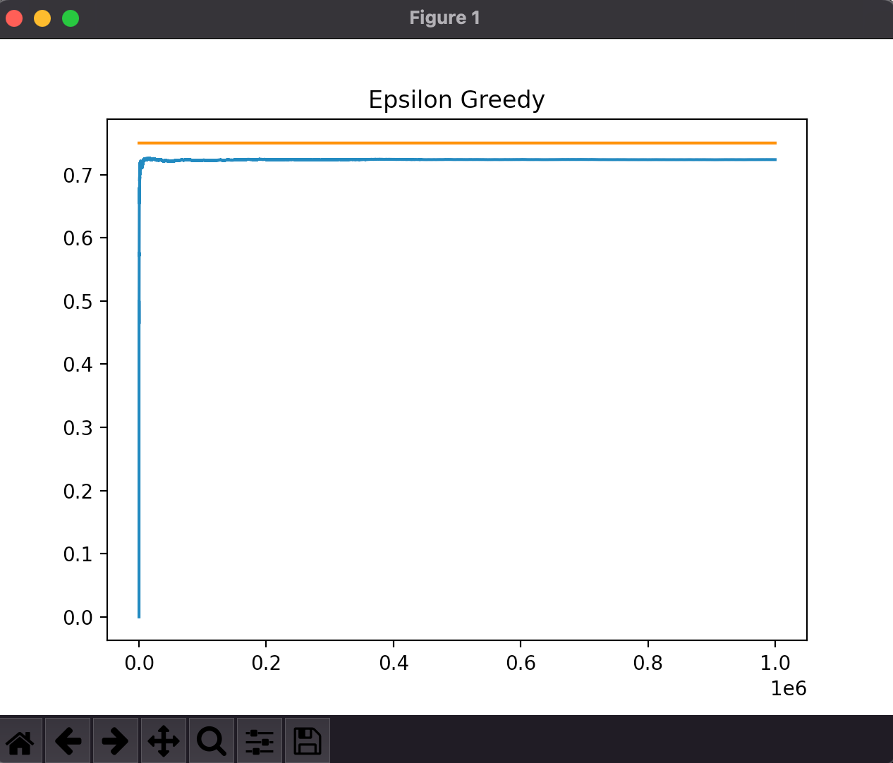
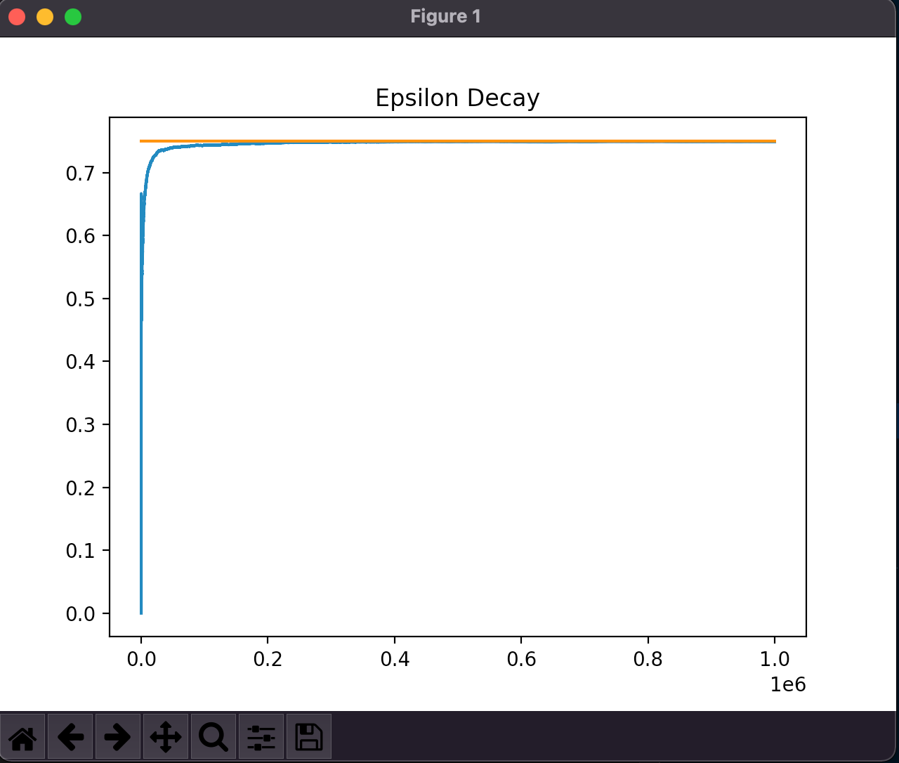

# EpsilonGreddy
Epsilon Greedy Algorithm implemented in python from scratch using Numpy. For the multi-armed bandit problem.


Epsilon Greedy Algorithm has following advantages:
  Balances between Explore and Exploit.
  Enchances Greedy Algorithm by choosing actions at a random at a small probability, represented by Epsilon ε
  
# Prerequisites
### Greedy Algorithm to better understand the importance of Epsilon Greedy.
### Advanced level python programming language understanding.

# The Greedy Algorithm
* Multi-armed bandit problem
* Always picking the bandit with the highest probability
### psuedocode
```python
while True:
  chosen_bandit = argmax(bandit means collected)
  reward = play bandit j and collect reward
  bandits[j].update_mean(reward)
```


# Pseudocode for epsilon greedy
* For multi-armed bandit problem
```python
while True:
  epsilon = 0.2
  randomProb = random number in [0,1]
  if randomProb < epsilon:
    j = choose a random bandit
  else:
    j = argmax(means of bandits)
  x = perform action on bandit j and get reward
  bandits[j].update_mean(x)
```
# Epsilon Greedy vs Epsilon Decay Strategy
* Decrementing Epsilon by mutliplying epsilon by 0.9995 is one of the most famous techniques used in traning a Deep Q Learning Network.
* The Epsilon Decay experiment achieved a maximum win rate of 75 percent while the max win rate Epsilon Greedy without any decay in Epsilon was able to achieve was 72.
* I repeated the experiment 20 times and took the best result out of each experiment.

## Results

### Epsilon Greedy


### Epsilon Greedy (Decay Epsilon)



* Although the difference between the both strategies might seem to small to consider Epsilon Decay as a effective improvement over Epsilon Greedy.
 * When you are you designing a complex AI such as which can play Atari or Space Invaders game Epsilon Decay can have huge improvements.